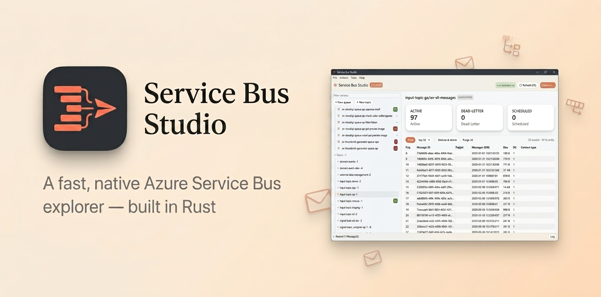

# Service Bus Studio



A fast, single-binary desktop explorer for Azure Service Bus. Rust rewrite inspired by
[paolosalvatori/ServiceBusExplorer](https://github.com/paolosalvatori/servicebusexplorer).

## Install

**Windows:** grab `ServiceBusStudio-*-windows-x64.zip` from the
[latest release](../../releases/latest), unzip anywhere, and run
`ServiceBusStudio.exe`. No installer, no runtime, no admin rights needed —
it's one self-contained file.

**macOS (Apple Silicon):** grab `ServiceBusStudio-*-macos-arm64.tar.gz` from the
[latest release](../../releases/latest), extract, and drag `ServiceBusStudio.app`
to Applications. The app is unsigned, so on first launch right-click → Open
(or run `xattr -cr ServiceBusStudio.app`).

**Build from source** (any platform with [Rust](https://rustup.rs)):

```
cargo build --release
```

## Getting started

On launch, paste a namespace connection string
(`Endpoint=sb://…;SharedAccessKeyName=…;SharedAccessKey=…`) into the Connect dialog.
Use a key with Manage rights for full functionality (Listen/Send is enough for messaging only).

## Features

- Namespace tree: queues, topics, subscriptions with live active / dead-letter counts
- Entity overview: all description properties, size, count stat cards
- Peek messages (non-destructive, AMQP) on queues, subscriptions, and their dead-letter queues
- Message inspector: system properties, application properties, JSON pretty-printed body, copy to clipboard
- Send messages: subject, content type, message/correlation/session IDs, TTL, custom properties, N copies
- Load a peeked message into the Send tab to edit & resend
- Dead-letter handling: resubmit selected/all (copy back to entity), receive & delete, purge
- Create / delete queues, topics, subscriptions
- Receive & delete / purge with confirmation dialogs
- Connection history (last 10, stored in `%APPDATA%\sbx.json` — plaintext, same caveat as the original tool)
- F5 refresh, entity filter, dark theme

## Roadmap

Planned for future versions (also listed in Help → About):

- **1.1** — Session browsing, scheduled-message list & cancel
- **1.2** — Subscription rules & filters CRUD
- **1.3** — Message import/export (JSON), bulk resubmit with edit
- **1.4** — Entra ID (Azure AD) sign-in, multiple saved namespaces with names
- Not planned: Event Hubs / Relay / Notification Hubs (separate products; deprecated in the original tool)

## Architecture

- `src/main.rs` — egui/eframe UI (immediate mode, single window)
- `src/worker.rs` — background tokio thread owning the AMQP client ([azservicebus](https://crates.io/crates/azservicebus)); UI ↔ worker via channels
- `src/mgmt.rs` — entity management over the Service Bus ATOM REST API with SAS auth
